# Mini Project - Heterogeneous API Implementation (Content Website)

This project implements a distributed system featuring REST, GraphQL, and SOAP APIs developed in Go, fronted by a Traefik API Gateway, and consumed by a React frontend application. The entire system is containerized using Docker and orchestrated with Docker Compose.

This project fulfills the requirements for the Web Services course mini-project (2024-2025).

**Theme:** Content Website (Movies, Series, Anime)

## Architecture

The system consists of the following components:

1.  **Frontend (`frontend`):** A React application (built with Vite, styled with Tailwind CSS) that serves as the user interface. It interacts with the backend APIs through the gateway.
2.  **Series API (`services/series-api`):** A RESTful API written in Go (using `net/http` and `gorilla/mux`) to manage TV series data. Listens internally on port `8081`.
3.  **Anime API (`services/anime-api`):** A GraphQL API written in Go (using `graphql-go`) to manage anime data. Listens internally on port `8082`.
4.  **Movies API (`services/movies-api`):** A simplified SOAP API written in Go (using `encoding/xml`) to manage movie data. Listens internally on port `8083`.
5.  **API Gateway (`gateway`):** A Traefik instance acting as a reverse proxy and API gateway. It routes incoming requests from the host machine (port 80) to the appropriate backend service based on URL paths. It also provides a dashboard for monitoring.
6.  **Docker Compose (`docker-compose.yml`):** Defines and orchestrates all the services, networks, and configurations required to run the entire system.

```mermaid
graph TD
    subgraph "User's Browser"
        A[User @ localhost]
    end

    subgraph "Docker Host (Port Mapping)"
        B(Traefik Gateway Container)
        A -- HTTP Request (Port 80) --> B
    end

    subgraph "Docker Network (webnet)"
        B -- Route based on Path --> C{Routing Logic}

        subgraph "Frontend Service"
            D["Frontend Container\n(Port 3000)"]
        end
        C -- Path: / --> D

        subgraph "Backend API Services"
            E["Series API Container\n(REST - Port 8081)"]
            F["Anime API Container\n(GraphQL - Port 8082)"]
            G["Movies API Container\n(SOAP - Port 8083)"]
        end
        C -- Path: /api/series --> E
        C -- Path: /api/anime --> F
        C -- Path: /api/movies --> G

        D -- API Call --> B
    end

    style B fill:#000000,stroke:#333,stroke-width:2px
    style D fill:#000000,stroke:#333,stroke-width:2px
    style E fill:#000000,stroke:#333,stroke-width:2px
    style F fill:#000000,stroke:#333,stroke-width:2px
    style G fill:#000000,stroke:#333,stroke-width:2px
```



## Prerequisites

Before running the project, ensure you have the following installed:

*   **Docker:** [Install Docker](https://docs.docker.com/get-docker/)
*   **Docker Compose:** (Usually included with Docker Desktop) [Install Docker Compose](https://docs.docker.com/compose/install/)

## Running the System

1.  **Clone the repository** (if you haven't already).
2.  **Navigate to the project root directory** in your terminal.
3.  **Build and start all services** using Docker Compose:
    ```bash
    docker-compose up --build -d
    ```
    *   `--build`: Forces Docker Compose to rebuild the images if any code or Dockerfiles have changed.
    *   `-d`: Runs the containers in detached mode (in the background).

    The first time you run this command, it might take a few minutes to download base images and build the application containers.

## Accessing Services

Once the containers are running, you can access the different parts of the system:

*   **Frontend Application:** Open your web browser and navigate to:
    *   `http://localhost` (or `http://localhost:80`)

*   **Traefik Dashboard:** Open your web browser and navigate to:
    *   `http://localhost:8080`

*   **API Gateway Endpoints:** The backend APIs are accessible through the gateway at the following base paths:
    *   Series API (REST): `http://localhost/api/series`
    *   Anime API (GraphQL): `http://localhost/api/anime/graphql`
    *   Movies API (SOAP): `http://localhost/api/movies/soap`

## API Documentation

Detailed documentation for each API endpoint, including request/response formats and examples, can be found in the [API Documentation](./api_docs.md) file.

## Stopping the System

To stop and remove all the running containers, network, and volumes defined in the `docker-compose.yml` file, run the following command in the project root directory:

```bash
docker-compose down
```

## Project Structure

```
.
├── api_docs.md             # Detailed API documentation
├── docker-compose.yml      # Docker Compose configuration
├── frontend/               # React frontend application
│   ├── Dockerfile
│   ├── src/
│   └── ...                 # Other React project files
├── gateway/                # Traefik configuration
│   └── traefik.yml         # Traefik static configuration (alternative)
├── plan.md                 # Project development plan
├── readme.md               # This file
└── services/               # Backend Go services
    ├── anime-api/          # GraphQL Anime API
    │   ├── Dockerfile
    │   ├── main.go
    │   └── ...
    ├── movies-api/         # SOAP Movies API
    │   ├── Dockerfile
    │   ├── main.go
    │   └── ...
    └── series-api/         # REST Series API
        ├── Dockerfile
        ├── main.go
        └── ...
```
